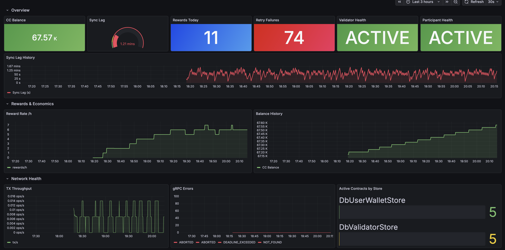
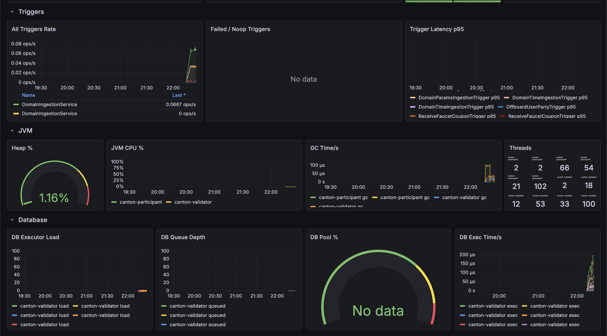
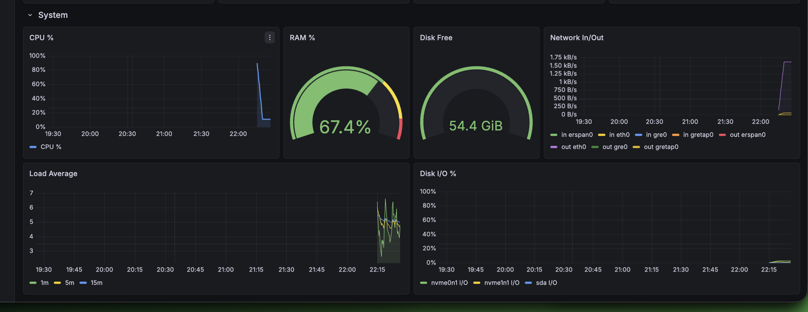

# Monitoring

Prometheus + Grafana + node-exporter stack for Canton validator observability.

---

## Start

Enable during setup (prompted during install), or start manually:

```bash
cd ~/canton-validator-toolkit/monitoring
CANTON_NETWORK_NAME=splice-validator docker compose up -d
```

`CANTON_NETWORK_NAME` must match the Docker Compose project name of your running validator. The default is `splice-validator`. If your containers are named `splice-devnet-validator-1`, set it to `splice-devnet`.

Check status:

```bash
docker ps | grep canton-
```

---

## Stack

| Component | Port | Description |
|-----------|------|-------------|
| Prometheus | `127.0.0.1:9091` | Metrics collection + storage |
| Grafana | `127.0.0.1:3001` (or Tailscale IP) | Dashboards + alerting |
| node-exporter | `127.0.0.1:9101` | System metrics (CPU / RAM / disk / network) |

All ports bound to `127.0.0.1` only — never exposed publicly. Access via SSH tunnel.

> **Port 9101 for node-exporter** — deliberately not 9100. Port 9100 is commonly occupied by a system-level node-exporter installed outside Docker. Using 9101 avoids the conflict.

---

## Access

### SSH tunnel

```bash
ssh -L 3001:127.0.0.1:3001 -L 9091:127.0.0.1:9091 user@your-server -N
# Grafana:    http://127.0.0.1:3001  (admin / admin)
# Prometheus: http://127.0.0.1:9091
```

### Tailscale (recommended)

Enable during setup when asked about Grafana remote access, or set up manually:

```bash
# On the validator server:
curl -fsSL https://tailscale.com/install.sh | sh
sudo tailscale up
# Open the URL shown, authorize in browser

# Get your Tailscale IP:
tailscale ip -4

# Restart monitoring with Tailscale IP binding:
cd ~/canton-validator-toolkit/monitoring
CANTON_NETWORK_NAME=splice-validator MONITOR_BIND_IP=<tailscale-ip> docker compose up -d
```

Then install Tailscale on your laptop/phone from [tailscale.com/download](https://tailscale.com/download) and open:
`http://<tailscale-ip>:3001`

No SSH tunnel needed. Works from mobile, works from anywhere on your Tailscale network.

Change Grafana password after first login: Profile → Change Password.

---

## Dashboard

The `canton-validator` dashboard is provisioned automatically on startup.







28 panels across 7 sections:

### Overview
- **CC Balance** — `splice_wallet_unlocked_amulet_balance`
- **Sync Lag** — time since last ingested record (green <30s / yellow <60s / red >60s)
- **Rewards Today** — `ReceiveFaucetCouponTrigger` completions in the last 24h
- **Retry Failures** — `splice_retries_failures` total (red if >0)
- **Version** — from `target_info` metric


### Rewards & Economics
- Reward rate per hour (time series)
- CC balance history (time series)

### Network Health
- Processing lag ms
- TX throughput (transactions/s)
- Active contracts by store
- gRPC errors (red if >0)

### Triggers
Canton has no "missed blocks" concept — triggers are the closest equivalent. A validator consistently processing `ReceiveFaucetCouponTrigger` is healthy.

- All triggers rate (by trigger_name)
- Failed / noop triggers
- Trigger latency p95

### JVM
- Heap usage % (gauge, red >85%)
- JVM CPU %
- GC time/s
- Thread count

### Database
- DB executor load
- DB queue depth
- DB connection pool %
- DB exec time/s

### System
- CPU %
- RAM %
- Disk free (red <20GB)
- Network in/out (excluding loopback / veth)
- Load average (1m / 5m / 15m)
- Disk I/O %

---

## Why a custom dashboard?

The Canton bundle ships 47 Grafana dashboards in:

```
~/.canton/<version>/splice-node/grafana-dashboards/
```

They cover participant, sequencer, JVM, database, network fees, CometBFT, and more. However, **none of them work in a docker-compose deployment out of the box**.

Every query in those dashboards filters by a `namespace` label:

```promql
rate(daml_sequencer_client_traffic_control_submitted_event_cost_total{
  namespace="$namespace", job="$job", ...
}[5m])
```

`namespace` is a Kubernetes label injected by kube-state-metrics or Prometheus operator — it does not exist in docker-compose metrics. All panels return no data.

Additionally, the dashboards define `namespace` as a required template variable populated by `label_values(...)`. On a docker-compose setup where the label is absent, the variable dropdown is empty and all panels stay blank.

This toolkit's dashboard is built from scratch using only labels that are actually present in docker-compose metrics — primarily `job` (set in `prometheus.yml`) and `instance`. All 28 panels are verified to show real data on a live validator.

The official dashboards can still be imported manually as a reference or for future Kubernetes deployments — they are not removed or replaced, just not used here.

---

## How scraping works

Prometheus scrapes Canton metrics **directly from container ports**, not via nginx:

```yaml
- job_name: 'canton-validator'
  static_configs:
    - targets: ['validator:10013']

- job_name: 'canton-participant'
  static_configs:
    - targets: ['participant:10013']
```

Standard Prometheus cannot set custom `Host` headers. The nginx config inside the Canton bundle routes requests to the correct backend based on the `Host` header (`validator.localhost`, `participant.localhost`). Prometheus would send the wrong host and get a 404.

Scraping port `10013` directly on the container bypasses nginx entirely and works reliably without any additional config.

The monitoring stack joins the `${CANTON_NETWORK_NAME}_splice_validator` Docker network to reach `validator` and `participant` by container name.

---

## Grafana alerts

Configure in Grafana UI: Alerting → Alert rules → New alert rule.

Recommended rules:

| Alert | Condition | Severity |
|-------|-----------|----------|
| ValidatorDown | `up{job="canton-validator"} == 0` for 2m | critical |
| SyncLagHigh | lag > 120s for 2m | critical |
| SyncLagWarning | lag > 60s for 5m | warning |
| RetryFailures | `splice_retries_failures > 10` | warning |
| HeapHigh | heap % > 85 for 5m | warning |
| DiskLow | disk free < 20GB | warning |
| gRPCErrors | gRPC error rate > 0 for 5m | warning |

### Telegram contact point

Grafana → Alerting → Contact points → Add contact point:
- Type: `Telegram`
- BOT API Token: your bot token
- Chat ID: your chat ID

Set as default contact point.

---

## Data retention

Default: **30 days**. To change:

```yaml
# monitoring/docker-compose.yml
command:
  - "--storage.tsdb.retention.time=60d"
```

---

## Uptime definition for Canton

Canton has no block signing. A validator is considered fully operational when all three conditions hold:

1. `splice-validator-validator-1` container status = `healthy`
2. Sync lag < 60s: `time()*1000 - splice_store_last_ingested_record_time_ms < 60000`
3. Receiving rewards: `rate(splice_trigger_completed_total{trigger_name="ReceiveFaucetCouponTrigger"}[1h]) > 0`

---

## Stop

```bash
cd ~/canton-validator-toolkit/monitoring
docker compose down
```

Data is preserved in Docker volumes (`prometheus_data`, `grafana_data`).
---

## Planned extensions

**PagerDuty / Slack / OpsGenie** — pluggable contact points via Grafana alerting, beyond Telegram.

**Reward tracker** — track `ReceiveFaucetCouponTrigger` completions over time, daily/weekly trends, CSV export.

**Multi-validator view** — single Grafana instance monitoring multiple validators across MainNet / TestNet / DevNet.
